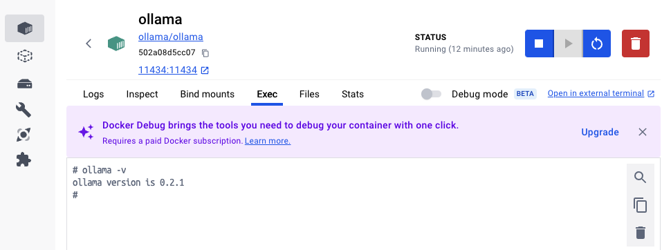

## Homework: Open-Source LLMs

In this homework, we'll experiment more with Ollama

> It's possible that your answers won't match exactly. If it's the case, select the closest one.

## Q1. Running Ollama with Docker

Let's run ollama with Docker. We will need to execute the 
same command as in the lectures:

```bash
docker run -it \
    --rm \
    -v ollama:/root/.ollama \
    -p 11434:11434 \
    --name ollama \
    ollama/ollama
```

What's the version of ollama client? 

To find out, enter the container and execute `ollama` with the `-v` flag.

### Answer

see picture below



## Q2. Downloading an LLM 

We will donwload a smaller LLM - gemma:2b. 

Again let's enter the container and pull the model:

```bash
ollama pull gemma:2b
```

In docker, it saved the results into `/root/.ollama`

We're interested in the metadata about this model. You can find
it in `models/manifests/registry.ollama.ai/library`

What's the content of the file related to gemma?

### Answer

```json

{
	"schemaVersion": 2,
	"mediaType": "application/vnd.docker.distribution.manifest.v2+json",
	"config": {
		"mediaType": "application/vnd.docker.container.image.v1+json",
		"digest": "sha256:887433b89a901c156f7e6944442f3c9e57f3c55d6ed52042cbb7303aea994290",
		"size": 483
	},
	"layers": [
		{
			"mediaType": "application/vnd.ollama.image.model",
			"digest": "sha256:c1864a5eb19305c40519da12cc543519e48a0697ecd30e15d5ac228644957d12",
			"size": 1678447520
		},
		{
			"mediaType": "application/vnd.ollama.image.license",
			"digest": "sha256:097a36493f718248845233af1d3fefe7a303f864fae13bc31a3a9704229378ca",
			"size": 8433
		},
		{
			"mediaType": "application/vnd.ollama.image.template",
			"digest": "sha256:109037bec39c0becc8221222ae23557559bc594290945a2c4221ab4f303b8871",
			"size": 136
		},
		{
			"mediaType": "application/vnd.ollama.image.params",
			"digest": "sha256:22a838ceb7fb22755a3b0ae9b4eadde629d19be1f651f73efb8c6b4e2cd0eea0",
			"size": 84
		}
	]
}
```


## Q3. Running the LLM

Test the following prompt: "10 * 10". What's the answer?

### Answer

To run a prompt we have to execute `ollama run gemma:2b` in docker and after that execute the prompt. The output is:

```bash
Sure, here is the model you requested:

10 * 10<sup>end_of_turn</sup>

This model performs the multiplication of 10 by 10 
using two different bases. The <sup>end_of_turn</sup> 
represents the end of the exponential expression and 
indicates that the multiplication should be performed in base 10.
```

## Q4. Donwloading the weights 

We don't want to pull the weights every time we run
a docker container. Let's do it once and have them available
every time we start a container.

First, we will need to change how we run the container.

Instead of mapping the `/root/.ollama` folder to a named volume,
let's map it to a local directory:

```bash
mkdir ollama_files

docker run -it \
    --rm \
    -v ./ollama_files:/root/.ollama \
    -p 11434:11434 \
    --name ollama \
    ollama/ollama
```

Now pull the model:

```bash
docker exec -it ollama ollama pull gemma:2b 
```

What's the size of the `ollama_files/models` folder? 

* 0.6G
* 1.2G
* 1.7G
* 2.2G

Hint: on linux, you can use `du -h` for that.

### Answer 


## Q5. Adding the weights 

Let's now stop the container and add the weights 
to a new image

For that, let's create a `Dockerfile`:

```dockerfile
FROM ollama/ollama

COPY ...
```

What do you put after `COPY`?

### Answer 

We put the following ``` ./ollama_files /root/.ollama ```

## Q6. Serving it 

Let's build it:

```bash
docker build -t ollama-gemma2b .
```

And run it:

```bash
docker run -it --rm -p 11434:11434 ollama-gemma2b
```

We can connect to it using the OpenAI client

Let's test it with the following prompt:

```python
prompt = "What's the formula for energy?"
```

Also, to make results reproducible, set the `temperature` parameter to 0:

```bash
response = client.chat.completions.create(
    #...
    temperature=0.0
)
```

How many completion tokens did you get in response?

* 304
* 604
* 904
* 1204

### Answer

See [homework2.ipynb](homework2.ipynb) for the implementation
